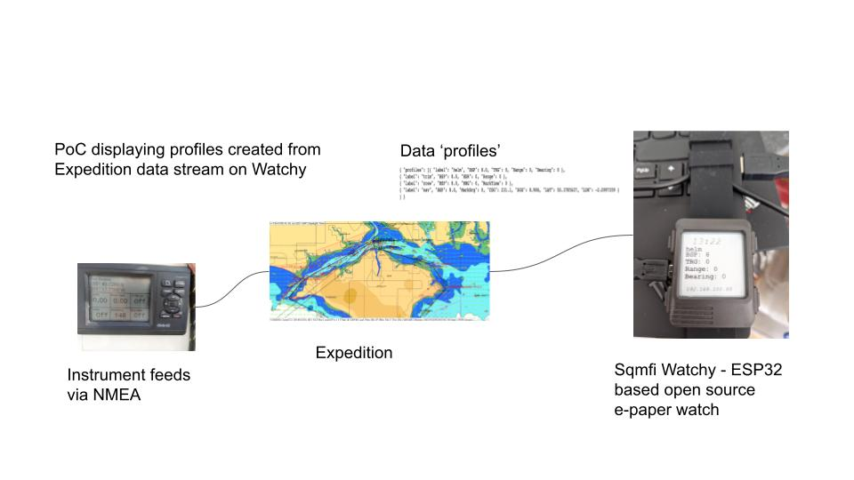

# exputils
Expedition utilities

- **expchdata.py** - this reads the UsrChannal.h file provided with Expedition and creates the data structure that the python program can use to decode the data stream
- **expupd.py** - connects to Expedition, decodes the data stream and creates the user profiles based on the user definitions in the file. The profiles are written to a data file for now.

To run these you need expedition to send expedition data on the standard port - CNTRL-I 

